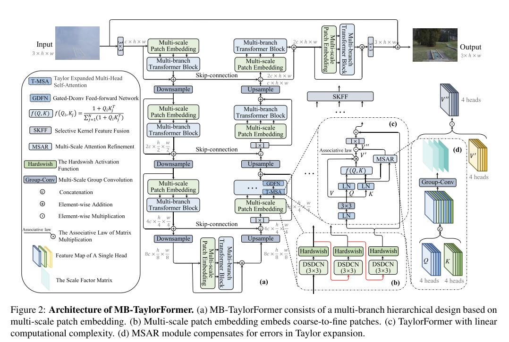

- **论文链接：**[https://arxiv.org/abs/2308.14036](https://arxiv.org/abs/2308.14036)
- **代码链接：**[https://github.com/FVL2020/ICCV-2023-MB-TaylorFormer](https://github.com/FVL2020/ICCV-2023-MB-TaylorFormer)
- **会议：** ICCV(2023)
- **Keywords**： Transformer, Image Dehazing

# Abastract

在图像去雾任务中，受 softmax-attention 二次计算（quadratic computational）复杂度的限制，Transformer 架构没有得到广泛应用。

为了解决这一问题，作者提出了一种新的 Transformer 架构，使用泰勒展开来逼近 softmax-attention，并实现了线形计算复杂度。提出了一种多尺度注意细化模块（multi-scale attention refinement）作为对泰勒展开误差的补充。在此基础上，提出了一种基于多尺度嵌入的多分支结构，该结构通过不同尺度的重叠可变形卷积来嵌入特征。multi-scale patch 的设计基于三个关键思想：

1. 不同大小的感受野;

2. 多层次语义信息;

3. 感受野形状灵活。

模型名为 Multi-branch Transformer，通过Taylor公式 （MB-TaylorFormer）进行扩展，可以在 patch 嵌入阶段更灵活地嵌入粗到细的特征，以有限的计算代价捕获长距离的像素交互。

在几个去雾基准上的实验结果表明，MB-TaylorFormer以较轻的计算负担实现了最先进的(SOTA)性能。

> 这里提到的二次计算复杂度和线性计算复杂度，是否可以理解为数据结构中的 $O(n^2)$ 和 $O(n)$

# 1. Introduction

首先介绍了深度学习在图像去雾任务中取得的优秀表现；接着介绍了 Transformer 直接应用于图像去雾任务中的几点挑战：

1. **计算量大：**Transformer 的计算复杂度与 feature map 的分辨率是二次的，这使得它不适合 pix-to-pix 的去雾任务。虽然有已经有一些工作通过在小空间窗口中应用 self-attention 来缓解这个问题，但 Transformer 的接收域受到限制;
2. **token 的设计：**visual Transformer 的基本元素通常有更灵活的尺度。然而，现有的 visual Transformer 网络通常通过固定的卷积核生成固定规模的 token。因此，在去雾任务中**引入灵活的 patch enbedding 仍有改进的空间**。

为了解决第一个问题，作者提出了一个由泰勒公式扩展的 Transformer 变体—— TaylorFormer，它将 self-attention 应用于跨空间维度的整个特征图，并保持线性计算复杂度（ $O(n)$ ）。

具体来说，作者通过在 softmax 上进行泰勒展开来计算 self-attention 的权值，然后利用矩阵乘法的结合律将 self-attention 的计算复杂度从 $O(n^2)$ 降低到 $O(n)$。该策略有三个优点:

1. 保留了 Transformer 对**数据间的远程依赖关系**建模的能力，避免了窗口分割造成的接收域减少;
2. 与使用基于内核的 self-attention 公式相比，它提供了**更强的值逼近**，并且类似于普通的 Transformer ;
3. 它使 Transformer 关注**像素级交互**，而不是通道级交互，这允许对特征进行更细粒度的处理。

对于第二个问题，作者提出了一种基于多尺度 patch embedding 的多分支编码-解码主干（a multi-branch encoder-decoder backbone）。

总结下来，本篇文章作者主要有以下几个贡献点：

1. **提出了一种基于线性化 Transformer 的新变体。**引入MSAR模块，进一步纠正 TaylorFormer 的自我主义错误；
2. **设计了一个具有多尺度 patch embedding 的多分支架构。**其中多尺度域、灵活的接受域形状和多层次的语义信息可以同时生成多尺度的符号，捕捉更强大的特征;
3. 在公共合成数据集和真实数据集上的实验结果表明，所提出的 MB-TaylorForme 在参数和 mac 数较少的情况下，就能实现最先进的 (SOTA) 性能。

# 2. Related Works

1. **CNN-based Image Dehazing**

2. **Efficient Self-attention**

   列举了现阶段针对降低 Transformer 计算量的相关工作，主要包括以下几个方面：

   1. 通过基于 self-attention 的滑动窗口来减少计算量
   2. 修改 softmax-attention 

3. **Multi-scale Transformer Networks**

# 3. MB-TaylorFormer

作者旨在建立一个高效和轻量级的基于 Transformer 的去雾网络。

在这一部分中，首先描述了 MB-TaylorFormer 的总体架构 (图2a)。然后介绍了三个核心模块:多尺度 patch embedding (图2b)、Taylor 扩展 self-attention (图2c) 和MSAR模块 (图2d)。

## 3.1 Multi-branch Backbone

对于输入图片 *I*，

1. 先使用卷积层进行浅层特征提取
2. 随后，采用一个四阶段的 encoder-decoder 网络进行深度特征提取
   1. 每个阶段包含一个 multi-scale patch 嵌入的残差块和一个多分支的 Transformer 块
   2. 使用 multi-scale patch embedding 生成 multi-scale token
   3. 然后将他们分别输入到 Multi-branch Transformer block
   4. 在 Multi-branch Transformer block 末端使用 SKFF 模块融合不同分支产生的特征

# 附

* [https://zhuanlan.zhihu.com/p/658312750](https://zhuanlan.zhihu.com/p/658312750)
